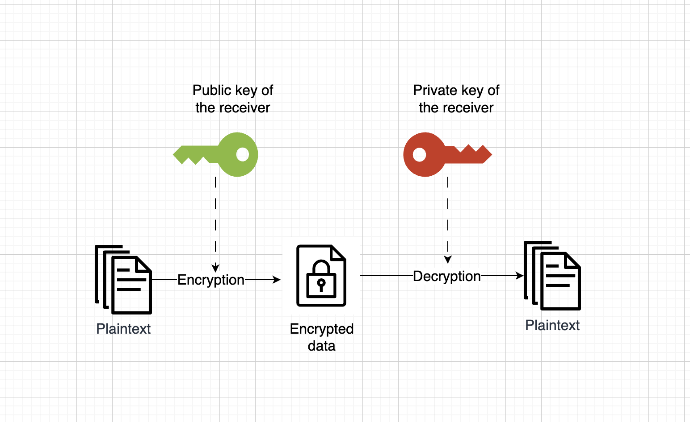

## Prewords

I recently watch this very nice movie: [Citizenfour](https://en.wikipedia.org/wiki/Citizenfour), the documentary about [Edward Snowden](https://en.wikipedia.org/wiki/Edward_Snowden) and the NSA surveillance scandal, and was captivated. Apart from the main story line (that we're all know and familiar of), one of the thing that sparked my interest was the extreme emphasis on operational security and the sophisticated tools Snowden used to protect his communications.

Growing up in the digital age, it's hard not to share information online. My data was everywhere: social media, apps, cloud services. Like most people, I assumed nobody cared about my boring personal information. Besides, what could I do about it anyway?

But, I do care. And I know that you care, too. That's why we're here, isn't it?

> Poll after poll is confirming that, contrary to what we tend to think, people not only care, they care a lot. The problem is we feel disempowered. We feel like we can't do anything about it, so we may as well not try. 
> - Snowden, in a public interview on privacy

## The need for encryption
I think there are a few reasons why this issue is surfacing in my mind lately.

### The amount of exposure I am to the internet is increasing

I've been moving my data between platforms more lately: email, messaging apps, cloud storage. Personally, I trust the platform, but not the people behind it. A blackbox service, with system admins holding too much access, and we're functioning with the hope that they won't abuse their power - a system built on trust alone.

> Trust no one
>- The X-files

Although I can't control who sees my data on these platforms, I can control what they see: encrypted files that are meaningless to plain eyes.

### Why do I care, if I don't have anything to hide
*But I didn't do anything wrong. Why would I need to do that if I am innocent?* Yeah alright, alright, I know! This phrase comes up in every privacy debate, and there is [a very good study on this.](https://papers.ssrn.com/sol3/papers.cfm?abstract_id=998565&)
My take is simple: You lock your doors, right? That's privacy in action. If you care enough to lock your physical space, you should care enough to lock your digital life.

## Different Encryption Methods
There are two main approaches to encryption, each with distinct use cases:

### Symmetric Encryption
[Symmetric encryption](https://en.wikipedia.org/wiki/Symmetric-key_algorithm) uses the same key for both encryption and decryption. It's simpler and faster than asymmetric encryption, but requires you to securely share the key with anyone who needs access.

Examples: [AES](https://en.wikipedia.org/wiki/Advanced_Encryption_Standard), [Salsa20](https://en.wikipedia.org/wiki/Salsa20#ChaCha_variant), ...


### Asymetric encrytion
[Asymmetric encryption](https://en.wikipedia.org/wiki/Public-key_cryptography) uses a pair of keys - one public, one private. Anyone can use your public key to encrypt messages, and you can decrypt those messages with your private key. This is perfect for secure communication between parties who've never met. This is how Snowden safely contacted the journalists in the movies.

Examples: [GPG/PGP](https://gnupg.org/), [RSA](https://en.wikipedia.org/wiki/RSA_cryptosystem), ...



## How to use the encryption tools
Here is the good news, you don't need to dig into the technical details of how the encryption algorithm works or understand its mathematical proof. You just need to know a few common encryption methods and decide what fits your use case. There are several tools will handle to work for you.

### OpenSSL for symmetric encryption
The OpenSSL software library is a robust, commercial-grade, full-featured toolkit for general-purpose cryptography and secure communication. Let's see a simple symmetric encryption process using OpenSSL.

The `openssl` usually comes pre-installed in most Linux distributions.

```shell
$ openssl command [ command_options ] [ command_arguments ]
```

In this guide, we will only discuss to encrypting aspect of `openssl`, that is, the [`enc` command.](https://wiki.openssl.org/index.php/Enc)

```shell
// To encrypt the data
$ openssl enc -ciphername -in un_encrypted.data -out encrypted.data
// To decrypt the data
$ openssl enc -d -ciphername -in encrypted.data -out un_encrypted.data
```

**Notes:** 
- You can get a list of `ciphername` using this command 
  ```shell
  $ openssl list -cipher-algorithms 
  ```
- Currently, the default key derivation is deprecated, so there might be a message like this 
  ```shell
    ...
    Verifying - enter AES-128-CBC encryption password:
    *** WARNING : deprecated key derivation used.
    Using -iter or -pbkdf2 would be better.
    ...
  ```
  You can just add `-pbkdf2` as the software suggested.
- By default, the output file will be in binary. If you prefer to copy/paste it instead, then you will need to encode it using the `-base64` flag
- When refering to the "password", we are talking about the your "private key".
- Critical point: decryption requires the exact same settings (flags) you used for encryption. Change one flag, and your data stays locked. So you better remember, not just your private key, but the entire command with all its flags that you used to encrypt your data.

   
Let's look at a real life example: you have a file `myfile.txt` that you need to encrypt. The whole process looks like this:

```shell
$ echo "This is a message" >> data.in
$ openssl enc -aes-128-cbc -in data.in -out encrypted.out -base64 -pbkdf2
enter AES-128-CBC encryption password: <Enter-your-password-here>
Verifying - enter AES-128-CBC encryption password: <Re-enter-your-password-here>
$ cat encrypted.out
U2FsdGVkX1/DTLJYX2liu9E3MhcTqcg2DdPeDyrUnsBdigJz24YMwlT1BdIsKXSA
```

To decrypt the message:
```shell
$ openssl enc -d -aes-128-cbc -in encrypted.out -out decrypted.out -base64 -pbkdf2
enter AES-128-CBC decryption password:
$ cat decrypted.out 
This is a message
```

And once again, *you must use the same encryption parameters when decrypting*. Document your full command if you must.

### GPG for asymetric encryption
GPG ([GNU Privacy Guard](https://en.wikipedia.org/wiki/GNU_Privacy_Guard), not to be confused with [Pretty Good Privacy](https://en.wikipedia.org/wiki/Pretty_Good_Privacy)) is the free, open-source implementation of the OpenPGP standard for public-key cryptography. It's a complete toolkit for public-key cryptography that handles the complex hybrid encryption process automatically. In this guide, we will walk through some core functionality: keypair creation, exchanging and verifying keys, encrypting and decrypting documents, and authenticating documents with digital signatures.

First, you need to generate your key pair (both public and private keys)

```shell
$ gpg --gen-key
```
GPG will walks you through creating your identity—name, email, and passphrase.

After that, you need to exchange the public keys with the person you want to communicate. To list the keys use this command `--list-keys`.

```shell
$ gpg --list-keys
gpg: checking the trustdb
gpg: marginals needed: 3  completes needed: 1  trust model: pgp
gpg: depth: 0  valid:   2  signed:   0  trust: 0-, 0q, 0n, 0m, 0f, 2u
gpg: next trustdb check due at 2028-05-23
[keyboxd]
---------
pub   ed25519 2025-05-24 [SC] [expires: 2028-05-23]
uid           [ultimate] real name <email.address@test.com>
sub   cv25519 2025-05-24 [E] [expires: 2028-05-23]
```

To send your public key to a correspondent you must first export it, this is done using the `--export` command. Use the `uid` email to specify the public key you want.

```shell
$ gpg --export email.address@test.com --output my_public_key.gpg
```

The key will be output in `my_public_key.gpg` in a binary format, but this can be inconvenient if you prefer to copy/paste the content. GnuPG therefore supports a command-line option `--armor` that that causes output to be generated in an ASCII-armored format similar to encoded documents.

```shell
$ gpg --export --armor email.address@test.com
-----BEGIN PGP PUBLIC KEY BLOCK-----
[...]
-----END PGP PUBLIC KEY BLOCK-----

// If you want write the output to a file use this instead
$ gpg --export --armor email.address@test.com > my_public_key.gpg
```

Note here that GPG's `--output` flag doesn't work with `--export`. Use the `>` redirect instead.


Let's say you have your file at `document.pdf`, to encrypt your file

```shell
bashgpg --encrypt --recipient john@example.com document.pdf
``` 

This creates document.pdf.gpg. GPG automatically:
- Uses John's public key to encrypt a random AES key
- Uses that AES key to encrypt your actual file
- Bundles everything together

The real output
When you run encryption, you'll see:
bash$ gpg --encrypt --recipient john@example.com document.pdf
gpg: checking the trustdb
gpg: marginal trust assumed for key
Don't panic at "marginal trust"—GPG is telling you it hasn't verified John's identity through its web of trust system.